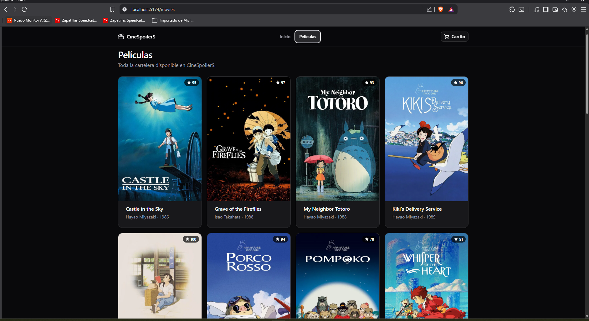

# Evidencias de Laboratorio 14

**Integrante:** Oscar Olano

1. Primera evidencia — Creación de proyecto e instalación de shadcn

2. Segunda evidencia — Creación de rutas

3. Tercera evidencia — Creación de layout

4. Cuarta evidencia — Homepage

**Integrante:** Gabriel Haro

1. Primera evidencia — Creación de proyecto e instalación de shadcn

2. Segunda evidencia — Creación de rutas

3. Tercera evidencia — Creación de layout

4. Cuarta evidencia — Homepage

**Integrante:** Gabriel Haro

1. Primera evidencia — Creación de proyecto e instalación de shadcn
.png>)

2. Segunda evidencia — Creación de rutas
.png>)

3. Tercera evidencia — Creación de layout

4. Cuarta evidencia — Homepage

